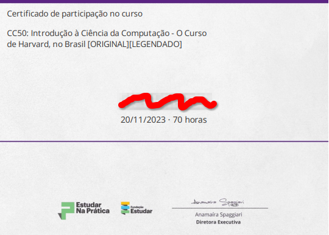

# CS50 - All exercises solved!

[:link: CS50 Official Page](https://www.edx.org/course/cs50s-introduction-to-computer-science/)

[:link: CC50 Official Page](https://napratica.org.br/curso-de-harvard-traduzido-cc50/)

---

This is CS50x , Harvard University's introduction to the intellectual enterprises of computer science and the art of programming for majors and non-majors alike, with or without prior programming experience. An entry-level course taught by David J. Malan, CS50x teaches students how to think algorithmically and solve problems efficiently. Topics include abstraction, algorithms, data structures, encapsulation, resource management, security, software engineering, and web development. Languages include C, Python, SQL, and JavaScript plus CSS and HTML. Problem sets inspired by real-world domains of biology, cryptography, finance, forensics, and gaming. The on-campus version of CS50x , CS50, is Harvard's largest course.

**This repo is not intended for cheating purposes, please do not copy the source code and pass it as your own!**

---

